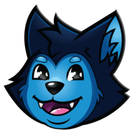

# OBS Setup - Backups, Color-Coded Scenes, and Animated Overlays

This is the home for my OBS Studio setup across two Macs (MacBook Pro
and Mac Mini): secret-scrubbed per-device backups, an import-ready
color-coded scene collection, animated stream overlays rendered from
code, and a small HTML previewer. It exists so I never lose a scene
layout again and can rebuild either Mac from a clean install in
minutes.

One command to back up. One download to restock OBS. No lost scenes.

## Table of Contents

- [Features](#features)
- [Getting Started](#getting-started)
- [Usage](#usage)
  - [Back up a Mac](#back-up-a-mac)
  - [Get the overlay, scene, and mask files](#get-the-overlay-scene-and-mask-files)
  - [Animated overlays](#animated-overlays)
  - [Rounded webcam masks](#rounded-webcam-masks)
- [Tech Stack](#tech-stack)
- [Development](#development)
  - [Prerequisites](#prerequisites)
  - [Setup](#setup)
  - [Development Scripts](#development-scripts)
  - [Code Quality](#code-quality)
- [Project Structure](#project-structure)
- [License](#license)
- [Contact](#contact)

## Features

- **Per-device backups.** One command scrubs secrets and files your
  OBS export into the repo under the right device automatically.
- **Secret-safe by default.** Browser widget URLs and Twitch stream
  keys are wiped before anything reaches git. The full un-wiped copy
  is zipped to your Downloads folder for Google Drive.
- **Import-ready scenes.** Generated OBS scene collections for both
  Macs with every source color-coded, cams pre-pinned to the overlay
  frames, and per-scene Wolfathon widget wrappers (Mac Mini).
- **Consistent color coding.** One palette across scenes and sources,
  so a glance tells you camera vs. alerts vs. screen vs. standby.
- **HTML previewer.** A color-coded map of every scene that runs
  locally or on GitHub Pages, no build step.
- **Animated overlays.** Eleven Remotion-built scenes with seamless
  looping motion (Starting Soon, Just Chatting, Just Chatting VTuber,
  Co-Working Solo/Dual, Be Right Back, Ending Stream, Background,
  Socials badge, Countdown, Loading Barks), rendered to video for OBS
  media sources.
- **One-command release bundle.** `make release` renders every
  overlay, transcodes the transparent ones to HEVC-alpha, regenerates
  the webcam masks, and zips a dated OBS drop-in bundle to
  `~/Downloads`.
- **CI-built bundles.** Every published GitHub Release builds the
  same bundle on a macOS runner and attaches the zip as a release
  asset, so the newest files are always one download away.
- **Rounded webcam masks.** Ready-made alpha PNGs that clip a live
  cam to match each overlay's rounded frame.
- **OBS JSON reference.** What the files contain, how source colors
  are stored, and exactly which fields are secrets.

## Getting Started

Full docs live in [`docs/`](docs/):

- [Backup guide](docs/backup-guide.md) - export, back up, and restore.
- [ADHD setup guide](docs/adhd-setup-guide.md) - the full scene /
  group / source table with the color for each item.
- [Color coding](docs/color-coding.md) - the palette and what each
  color means.
- [Audio levels](docs/audio-levels.md) - target levels per source.
- [OBS JSON reference](docs/obs-json-reference.md) - file format and
  the color field.
- [Mask install steps](masks/README.md) - apply the rounded webcam
  masks in OBS.
- [Overlay assets and rendering](remotion/ASSETS.md) - asset drop-in
  and render details.

Quick start:

1. Download `OBS-overlays-<date>.zip` from the newest
   [GitHub Release](https://github.com/MrDemonWolf/obs-setup/releases)
   - it contains every overlay video, the webcam masks, and a README
   with the exact OBS media-source and placement settings. No clone
   needed just to use the overlays. (No releases yet? Build it
   locally with `make release`.)
2. To import the scene layout, clone the repo and in OBS use
   `Scene Collection -> Import ->`
   `devices/macbook-pro/scenes/MBP-Streaming.json` (MacBook Pro) or
   `devices/mac-mini/scenes/Mini-Streaming.json` (Mac Mini).
3. After import, select your camera device and display, and paste
   your alert and widget URLs (they ship empty on purpose).
4. Run `make preview` and open <http://localhost:8000> to see the
   color-coded layout map.

## Usage

Everything runs through `make`:

| Command        | What it does                                                                                          |
| -------------- | ----------------------------------------------------------------------------------------------------- |
| `make backup`  | Zips your `~/Downloads/OBS` export, then files a scrubbed copy into the repo for the current device.  |
| `make release` | Renders every overlay, regenerates masks, and zips a dated OBS bundle into `~/Downloads`.             |
| `make preview` | Serves the color-coded previewer at <http://localhost:8000>.                                          |
| `make gen`     | Regenerates both device scene collections (MacBook Pro + Mac Mini).                                   |
| `make masks`   | Regenerates the rounded webcam masks from the frame geometry.                                         |
| `make`         | Lists the available commands.                                                                         |

### Back up a Mac

1. In OBS: `Scene Collection -> Export` and `Profile -> Export` into
   `~/Downloads/OBS`.
2. Run `make backup`. It detects the Mac by its name, writes
   `~/Downloads/OBS-backups/<Device>-<date>.zip` (upload that to
   Google Drive), and copies a secret-free version into
   `devices/<device>/`.
3. Review `git status` and commit.

Force the device when auto-detect is wrong:

```bash
DEVICE=mac-mini make backup
```

### Get the overlay, scene, and mask files

The easiest path is the release bundle - no local rendering needed:

1. Go to the
   [Releases page](https://github.com/MrDemonWolf/obs-setup/releases)
   and download `OBS-overlays-<date>.zip` from the newest release.
2. Unzip. Inside: `Overlays/opaque/` (full-frame looping MP4s),
   `Overlays/transparent/` (HEVC-alpha `.mov` widgets), `Masks/`
   (webcam masks), and a `README.md` with the file-to-scene table,
   loop settings, and exact webcam placement coordinates.
3. Add each video in OBS as a Media Source and follow that README.

To build the same bundle locally:

```bash
make release              # reuses the heavy ProRes masters if present
make release FORCE=--force  # re-render everything (after overlay edits)
```

Both paths end with `~/Downloads/OBS-overlays-<date>.zip`, ready to
copy to Google Drive. On GitHub, `.github/workflows/release.yml` runs
the identical pipeline on a macOS runner for every published release
(`workflow_dispatch` builds it as a downloadable artifact instead).

### Animated overlays

The animated stream scenes live in [`remotion/`](remotion/) as a
separate Node project:

```bash
cd remotion
npm install
npm run obs         # previewer - a button per scene
npm run dev         # Remotion Studio
npm run render:all  # render the standard set into out/
```

Composition ids: `StartingSoon`, `BRB`, `JustChatting`,
`JustChattingVtuber`, `CoworkingSolo`, `CoworkingDual`,
`EndingStream`, `Background` (full-frame MP4s), plus three
transparent overlays: `Socials` (760x180 badge), `Countdown` (5:00
timer, plays once), and `LoadingBarks` (fake loading bar with wolf
puns). The heavy `Countdown` and `LoadingBarks` ProRes masters are
excluded from `render:all`; `make release` (or a manual
`npx remotion render`) handles them.

### Rounded webcam masks

The Just Chatting and Co-Working overlays draw rounded cam frames. To
make a live cam match that rounding, [`masks/`](masks/) has a
ready-made alpha mask per cam. Apply one to the cam source with an
**Image Mask/Blend** filter (Alpha Mask, Alpha Channel) - see
[`masks/README.md`](masks/README.md) for the size and position of
each and the step-by-step. Regenerate with `make masks` if you retune
a frame.

## Tech Stack

| Layer       | Technology                                                   |
| ----------- | ------------------------------------------------------------ |
| Scripts     | Python 3 (standard library) + Bash                           |
| Task runner | GNU Make                                                     |
| Previewer   | Plain HTML, CSS, and JavaScript                              |
| Overlays    | Remotion 4 (React 19), Vite previewer with @remotion/player  |
| Transcode   | ffmpeg with Apple VideoToolbox (HEVC-alpha)                  |
| CI          | GitHub Actions (macOS runner) building release bundles       |
| Hosting     | GitHub Pages (serves the repo root)                          |
| Target      | OBS Studio 30+ on macOS                                      |

## Development

### Prerequisites

- macOS with the built-in `python3`, `bash`, `zip`, and `make`.
- OBS Studio 30 or newer.
- Node.js 18+ (only for the `remotion/` overlays).
- `ffmpeg` (only for `make release` HEVC-alpha transcodes).
- Pillow (`pip install pillow`, only for `make masks`).

### Setup

Clone the repo:

```bash
git clone git@github.com:MrDemonWolf/obs-setup.git
cd obs-setup
```

The backup, generator, and previewer need no install step - the
scripts use only the Python standard library. For the overlays:

```bash
cd remotion
npm install
```

### Development Scripts

- `scripts/gen_scene_collection.py` - builds the MacBook Pro scene
  collection from the layout defined at the top of the file. Run with
  `make gen`.
- `scripts/sanitize.py` - copies an OBS export into
  `devices/<slug>/`, wiping browser URLs and stream keys. Called by
  the backup script.
- `scripts/backup.sh` - detects the device, zips the raw export, runs
  the sanitizer. Run with `make backup`.
- `release.sh` - the full bundle pipeline. Run with `make release`.
- `masks/gen_masks.py` - regenerates the webcam masks. Run with
  `make masks`.
- In `remotion/`: `npm run obs` (previewer), `npm run dev` (Remotion
  Studio), `npm run lint` (eslint + tsc), `npm run render:all`.

### Code Quality

- Standard-library Python only - no dependencies to install or
  update outside `remotion/`.
- `gen_scene_collection.py` runs a self-check (ABGR color math plus
  every scene item references a real source) before it writes
  anything.
- `remotion/` is linted with eslint and type-checked with tsc
  (`npm run lint`).
- Every overlay loops seamlessly by construction - all motion is
  periodic over the full composition length.

## Project Structure

```text
obs-setup/
├── index.html                # color-coded previewer (also the GitHub Pages site)
├── Makefile                  # backup / release / preview / gen / masks
├── release.sh                # render + transcode + masks + zip, one command
├── assets/                   # repo art (MrDemonWolf logo)
├── .github/workflows/
│   └── release.yml           # builds the OBS bundle on every GitHub Release
├── devices/
│   ├── macbook-pro/          # portable rig
│   │   ├── index.json        # which scene files exist (read by the previewer)
│   │   ├── scenes/           # scene collection JSON (secret-free)
│   │   └── profiles/         # profile settings (stream key wiped)
│   └── mac-mini/             # main home setup (populated on first backup)
├── scripts/
│   ├── gen_scene_collection.py
│   ├── sanitize.py
│   └── backup.sh
├── docs/
│   ├── adhd-setup-guide.md
│   ├── audio-levels.md
│   ├── backup-guide.md
│   ├── color-coding.md
│   └── obs-json-reference.md
├── masks/                    # rounded webcam masks for the cam-frame overlays
│   ├── *.png                 # one alpha mask per cam (named per overlay)
│   ├── gen_masks.py          # regenerate from the frame geometry
│   └── README.md             # OBS Image Mask/Blend steps
└── remotion/                 # animated overlays (separate Node project)
    ├── src/                  # scenes + layers
    │   ├── scenes.ts         # every scene (single source of truth)
    │   ├── Root.tsx          # registers each scene as a composition
    │   ├── Scene.tsx         # card layout; JustChattingScene / CoworkFrame / BackdropScene / Socials
    │   ├── wolf/             # night ambience (Moon, Starfield, Embers, PawTrail)
    │   └── theme.ts          # palette + seamless-loop helpers
    ├── preview/              # macOS-style previewer (Vite + @remotion/player)
    ├── public/               # mascot SVGs (logo-*.svg) + brands/ (social logos)
    ├── render-all.mjs        # render the standard set into out/
    ├── to-hevc.sh            # transcode transparent masters to HEVC-alpha
    └── ASSETS.md             # asset drop-in + render/OBS instructions
```

## License


## Contact

Questions or ideas:

- Discord: [Join my server](https://mrdwolf.net/discord)

---

Made with love by [MrDemonWolf, Inc.](https://www.mrdemonwolf.com)
