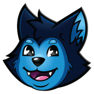

# OBS Setup - Backups, Color-Coded Scenes, and Animated Overlays

This is the home for my OBS Studio setup across two Macs (MacBook Pro
and Mac Mini): secret-scrubbed per-device backups, an import-ready
color-coded scene collection, animated stream overlays rendered from
code, and a small HTML previewer. It exists so I never lose a scene
layout again and can rebuild either Mac from a clean install in
minutes.

One command to back up. Separate downloads for overlays and transitions. No lost scenes.

## Table of Contents

- [Features](#features)
- [Getting Started](#getting-started)
- [Usage](#usage)
  - [Back up a Mac](#back-up-a-mac)
  - [Get the overlay, scene, and mask files](#get-the-overlay-scene-and-mask-files)
  - [Animated overlays](#animated-overlays)
  - [Rounded webcam masks](#rounded-webcam-masks)
- [Tech Stack](#tech-stack)
- [Development](#development)
  - [Prerequisites](#prerequisites)
  - [Setup](#setup)
  - [Development Scripts](#development-scripts)
  - [Code Quality](#code-quality)
- [Project Structure](#project-structure)
- [License](#license)
- [Contact](#contact)

## Features

- **Per-device backups.** One command reads live macOS OBS settings, saves a
  full private ZIP, and files a scrubbed copy under the right device.
- **Known secrets scrubbed.** Source URLs and stream keys are wiped from
  the Git copy; unsupported files stay in the raw ZIP. Review the staged
  diff before committing. The full scenes/profiles snapshot goes to Google Drive.
- **Import-ready scenes.** Generated OBS scene collections for both
  Macs with every source color-coded, cams pre-pinned to the overlay
  frames, and per-scene Wolfathon widget wrappers (Mac Mini).
- **Consistent color coding.** One palette across scenes and sources,
  so a glance tells you camera vs. alerts vs. screen vs. standby.
- **HTML previewer.** A color-coded map of every scene that runs
  locally or on GitHub Pages, no build step.
- **Animated overlays.** Eleven Remotion-built scenes with seamless
  looping motion (Starting Soon, Just Chatting, Just Chatting VTuber,
  Co-Working Solo/Dual, Be Right Back, Ending Stream, Background,
  Socials badge, Countdown, Loading Barks), rendered to video for OBS
  media sources.
- **Branded stinger transition.** A 4-second alpha wipe (`Stinger`) for
  OBS scene cuts. Its whoosh is embedded in the video; a timing check
  aligns the measured WAV peak with the covered scene-swap point.
- **Separate downloads.** `make release` renders the overlays and stinger
  with Remotion, encodes the transparent videos, regenerates the webcam
  masks, then writes two dated ZIPs to `~/Downloads`: one for scene overlays
  and masks, another for the Stinger video, source WAV, and setup guide.
- **CI-built release assets.** GitHub Actions lints and type-checks the
  Remotion project, smoke-renders and checks the stinger timing, then renders
  both complete downloads on a macOS runner for published GitHub Releases.
- **Rounded webcam masks.** Ready-made alpha PNGs that clip a live
  cam to match each overlay's rounded frame.
- **OBS JSON reference.** What the files contain, how source colors
  are stored, and exactly which fields are secrets.

## Getting Started

Full docs live in [`docs/`](docs/):

- [Backup guide](docs/backup-guide.md) - configure, back up, and restore.
- [ADHD setup guide](docs/adhd-setup-guide.md) - the full scene /
  group / source table with the color for each item.
- [Color coding](docs/color-coding.md) - the palette and what each
  color means.
- [Audio levels](docs/audio-levels.md) - target levels per source.
- [Stinger transition setup](docs/stinger-setup.md) - configure the
  branded scene-cut wipe from zero on each Mac.
- [OBS JSON reference](docs/obs-json-reference.md) - file format and
  the color field.
- [Mask install steps](masks/README.md) - apply the rounded webcam
  masks in OBS.
- [Overlay assets and rendering](remotion/ASSETS.md) - asset drop-in
  and render details.

Quick start:

1. Download `OBS-overlays-<date>.zip` from the newest
   [GitHub Release](https://github.com/MrDemonWolf/obs-setup/releases)
   for scene overlay videos and webcam masks. Download `OBS-stinger-<date>.zip`
   separately for the scene transition. Each archive includes its setup
   README. (No releases yet? Build both locally with `make release`.)
2. To import the scene layout, clone the repo and in OBS use
   `Scene Collection -> Import ->`
   `devices/macbook-pro/scenes/MBP-Streaming.json` (MacBook Pro) or
   `devices/mac-mini/scenes/Mini-Streaming.json` (Mac Mini).
3. After import, select your camera device and display, and paste
   your alert and widget URLs (they ship empty on purpose).
4. Run `make preview` and open <http://localhost:8000> to see the
   color-coded layout map.

## Usage

Everything runs through `make`:

| Command        | What it does                                                                                          |
| -------------- | ----------------------------------------------------------------------------------------------------- |
| `make backup`  | Zips live macOS OBS settings, then files a scrubbed copy into the repo for the current device.  |
| `make release` | Renders and validates the overlays and stinger, then writes two dated ZIPs to `~/Downloads`.             |
| `make preview` | Serves the color-coded previewer at <http://localhost:8000>.                                          |
| `make gen`     | Regenerates both device scene collections (MacBook Pro + Mac Mini).                                   |
| `make masks`   | Regenerates the rounded webcam masks from the frame geometry.                                         |
| `make`         | Lists the available commands.                                                                         |

### Back up a Mac

1. Install with `brew tap mrdemonwolf/den && brew install obs-backup`, clone
   this repo, then run `obs-backup setup` once to choose the Google Drive folder.
   Or run `bash scripts/backup.sh setup` for a local command install.
2. Run `obs-backup` (or `make backup` from this repo). It reads OBS's live
   macOS settings, detects the Mac by its name, writes
   `~/Library/CloudStorage/GoogleDrive-nathanial.henniges@mrdemonwolf.com/My Drive/Backups/OBS/<LocalHostName>/<Device>-<timestamp>.zip`,
   and copies a scrubbed version into
   `devices/<device>/`.
3. Review `git status` and the staged diff before committing.

Force the device when auto-detect is wrong:

```bash
DEVICE=mac-mini make backup
```

### Get the overlay, scene, and mask files

The easiest path is the release bundle - no local rendering needed:

1. Go to the
   [Releases page](https://github.com/MrDemonWolf/obs-setup/releases)
   and download `OBS-overlays-<date>.zip` for scene videos and masks. Download
   `OBS-stinger-<date>.zip` separately for the transition.
2. Unzip the overlays archive: `Overlays/` has the 11 scene videos and
   transparent widgets; `Masks/` has the rounded webcam masks. Its README
   lists the scene mapping, loop settings, and webcam placement coordinates.
3. Add the overlay videos in OBS as Media Sources. The Stinger archive
   contains `stinger-hevc.mov`, the original `stinger.wav`, and its own setup
   guide. Configure the video under **Scene Transitions → + → Stinger** with
   Transition Point **2000 ms**. Its sound is embedded; do not add the WAV as
   a second OBS audio source.

To build the same bundle locally:

```bash
make release              # reuses the heavy ProRes masters if present
make release FORCE=--force  # re-render everything (after overlay edits)
```

If all renders are already present and only the ZIP step needs to be retried,
run `./release.sh --package-only` from the repository root.

Both archives end up in `~/Downloads/`: `OBS-overlays-<date>.zip` and
`OBS-stinger-<date>.zip`. Set `OBS_RELEASE_OUTPUT_DIR` to choose another
output folder. On GitHub, `.github/workflows/release.yml` attaches both ZIPs
to each published release; a manual workflow run uploads them as separate
artifacts instead.

### Animated overlays

The animated stream scenes live in [`remotion/`](remotion/) as a
separate Node project:

```bash
cd remotion
npm install
npm run obs         # previewer - a button per scene
npm run dev         # Remotion Studio
npm run render:all  # render the standard set into out/
```

Composition ids: `StartingSoon`, `BRB`, `JustChatting`,
`JustChattingVtuber`, `CoworkingSolo`, `CoworkingDual`,
`EndingStream`, `Background` (full-frame MP4s), plus three
transparent overlays: `Socials` (760x180 badge), `Countdown` (5:00
timer, plays once), and `LoadingBarks` (fake loading bar with wolf
puns), plus the `Stinger` transition (4s alpha wipe, plays once). The
heavy `Countdown` and `LoadingBarks` ProRes masters are excluded from
`render:all`; `make release` (or a manual `npx remotion render`)
handles them and the stinger.

### Rounded webcam masks

The Just Chatting and Co-Working overlays draw rounded cam frames. To
make a live cam match that rounding, [`masks/`](masks/) has a
ready-made alpha mask per cam. Apply one to the cam source with an
**Image Mask/Blend** filter (Alpha Mask, Alpha Channel) - see
[`masks/README.md`](masks/README.md) for the size and position of
each and the step-by-step. Regenerate with `make masks` if you retune
a frame.

## Tech Stack

| Layer       | Technology                                                   |
| ----------- | ------------------------------------------------------------ |
| Scripts     | Python 3 (standard library) + Bash                           |
| Task runner | GNU Make                                                     |
| Previewer   | Plain HTML, CSS, and JavaScript                              |
| Overlays    | Remotion 4 (React 19), Vite previewer with @remotion/player  |
| Transcode   | ffmpeg with Apple VideoToolbox (HEVC-alpha)                  |
| CI          | GitHub Actions (macOS runner) building release bundles       |
| Hosting     | GitHub Pages (serves the repo root)                          |
| Target      | OBS Studio 30+ on macOS                                      |

## Development

### Prerequisites

- macOS with the built-in `python3`, `bash`, `zip`, and `make`.
- OBS Studio 30 or newer.
- Node.js 18+ (only for the `remotion/` overlays).
- `ffmpeg` (only for `make release` HEVC-alpha transcodes).
- Pillow (`pip install pillow`, only for `make masks`).

### Setup

Clone the repo:

```bash
git clone git@github.com:MrDemonWolf/obs-setup.git
cd obs-setup
```

The backup, generator, and previewer need no package install - the
scripts use macOS tools and the Python standard library. For a global backup
command, run `bash scripts/backup.sh setup`. For the overlays:

```bash
cd remotion
npm install
```

### Development Scripts

- `scripts/gen_scene_collection.py` - builds both device scene
  collections (MacBook Pro + Mac Mini) from the per-device layouts
  defined at the top of the file. Run with `make gen`.
- `scripts/sanitize.py` - copies live OBS settings into
  `devices/<slug>/`, wiping URLs, keys, and tokens. Called by
  the backup script.
- `scripts/backup.sh` - detects the device, zips a raw snapshot, runs
  the sanitizer. Run with `obs-backup` or `make backup`.
- `release.sh` - the Remotion render, audio validation, encoding, and two-ZIP
  packaging pipeline. Run with `make release`.
- `scripts/validate_stinger.py` - checks the measured WAV-to-cover timing and
  the rendered PCM track.
- `scripts/validate_release_packages.py` - checks both ZIP manifests and
  ensures the stinger stays separate from the overlay package.
- `masks/gen_masks.py` - regenerates the webcam masks. Run with
  `make masks`.
- In `remotion/`: `npm run obs` (previewer), `npm run dev` (Remotion
  Studio), `npm run lint` (eslint + tsc), `npm run render:all`.

### Code Quality

- Standard-library Python only - no dependencies to install or
  update outside `remotion/`.
- `gen_scene_collection.py` runs a self-check (ABGR color math plus
  every scene item references a real source) before it writes
  anything.
- `remotion/` is linted with eslint and type-checked with tsc
  (`npm run lint`).
- Python CI checks verify the checked-in WAV timing, frame delay, and package
  contents. A macOS job renders the Remotion stinger and confirms its audio is
  embedded byte-for-byte at the intended frame; release builds repeat the
  checks after HEVC encoding and before packaging.
- Every overlay loops seamlessly by construction - all motion is
  periodic over the full composition length.

## Project Structure

```text
obs-setup/
├── index.html                # color-coded previewer (also the GitHub Pages site)
├── Makefile                  # backup / release / preview / gen / masks
├── release.sh                # render + transcode + masks + zip, one command
├── assets/                   # repo art (MrDemonWolf logo)
├── .github/workflows/
│   ├── ci.yml                # Python, Remotion, and stinger render checks
│   └── release.yml           # builds two downloads for each GitHub Release
├── devices/
│   ├── macbook-pro/          # portable rig
│   │   ├── index.json        # which scene files exist (read by the previewer)
│   │   ├── scenes/           # scene collection JSON (secret-free)
│   │   └── profiles/         # profile settings (stream key wiped)
│   └── mac-mini/             # main home rig
│       ├── index.json        # which scene files exist (read by the previewer)
│       └── scenes/           # generated collection + sanitized live backup
├── scripts/
│   ├── gen_scene_collection.py
│   ├── sanitize.py
│   ├── backup.sh
│   ├── validate_stinger.py
│   └── validate_release_packages.py
├── docs/
│   ├── adhd-setup-guide.md
│   ├── audio-levels.md
│   ├── backup-guide.md
│   ├── color-coding.md
│   ├── obs-json-reference.md
│   └── stinger-setup.md
├── masks/                    # rounded webcam masks for the cam-frame overlays
│   ├── *.png                 # one alpha mask per cam (named per overlay)
│   ├── gen_masks.py          # regenerate from the frame geometry
│   └── README.md             # OBS Image Mask/Blend steps
├── remotion/                 # animated overlays (separate Node project)
    ├── src/                  # scenes + layers
    │   ├── scenes.ts         # every scene (single source of truth)
    │   ├── Root.tsx          # registers each scene as a composition
    │   ├── Scene.tsx         # card layout; JustChattingScene / CoworkFrame / BackdropScene / Socials
    │   ├── wolf/             # night ambience (Moon, Starfield, Embers, PawTrail)
    │   └── theme.ts          # palette + seamless-loop helpers
    ├── preview/              # macOS-style previewer (Vite + @remotion/player)
    ├── public/               # mascot SVGs (logo-*.svg) + brands/ (social logos)
    ├── render-all.mjs        # render the standard set into out/
    ├── to-hevc.sh            # transcode transparent masters to HEVC-alpha
    └── ASSETS.md             # asset drop-in + render/OBS instructions
└── tests/                    # Python tests for secret scrubbing and releases
```

## License


## Contact

Questions or ideas:

- Discord: [Join my server](https://mrdwolf.net/discord)

---

Made with love by [MrDemonWolf, Inc.](https://www.mrdemonwolf.com)
